# Software installation

## Prepare Raspberry Pi OS SD Card

To prepare SD Card, you need to have [Raspberry Pi Imager](https://www.raspberrypi.com/software/) software installed on your computer.

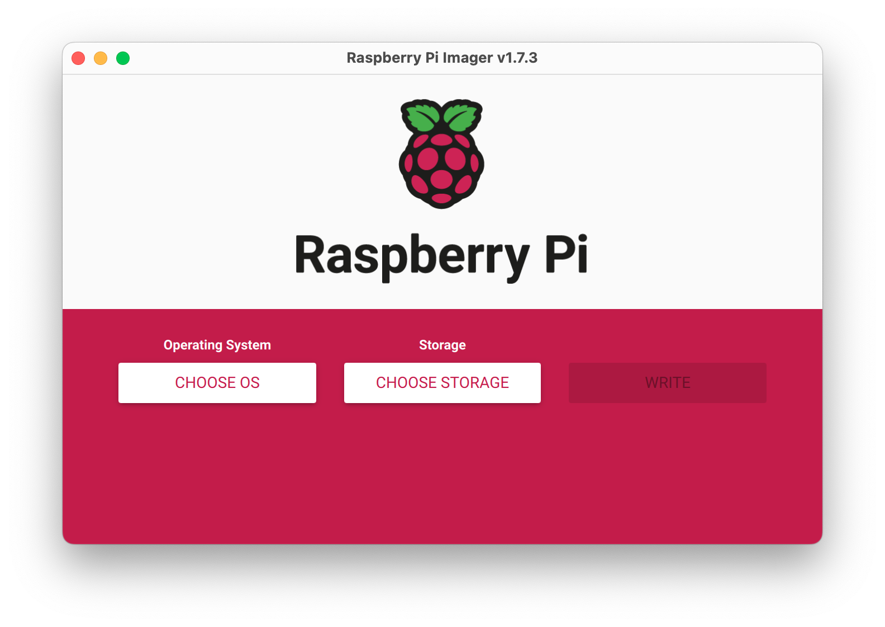

1. Choose the OS Image by clicking on "Choose OS" button, selecting "Raspberry Pi OS (other)" and then "Raspberry Pi OS Lite (32-bit)":
   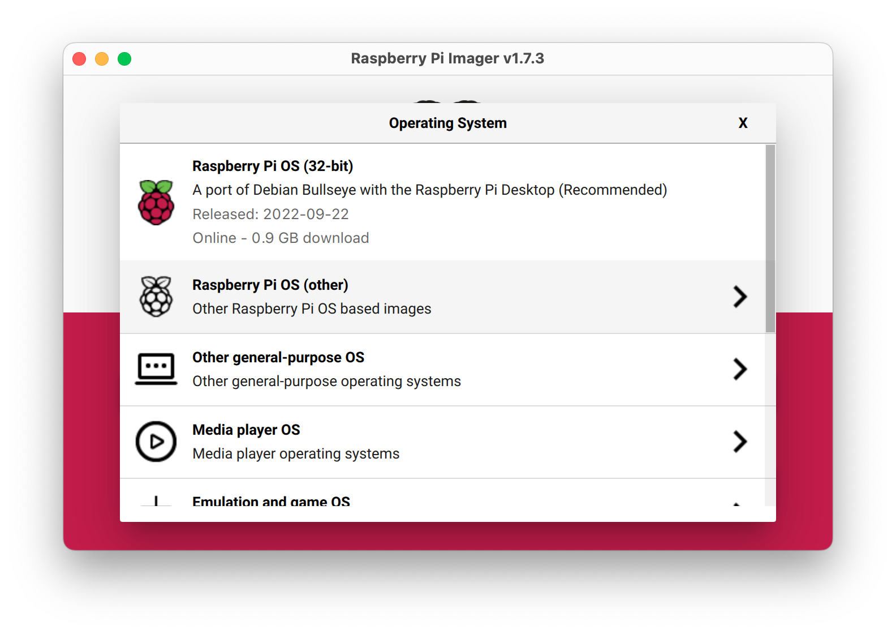
   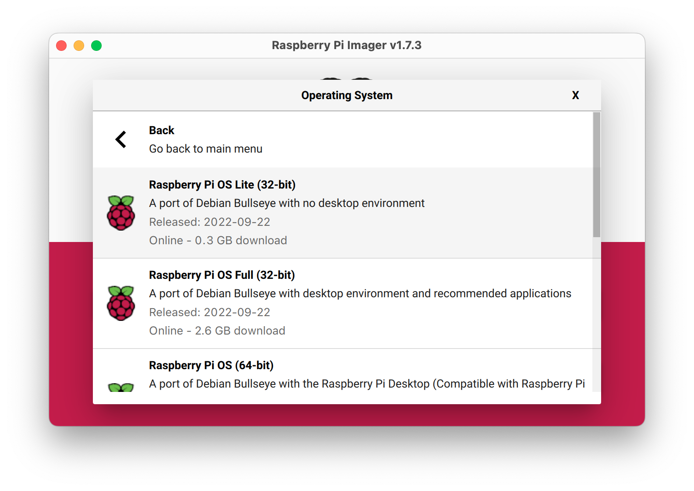

   > ⚠️ 32-bit Raspberry Pi OS version is recommended because it supports more performant legacy Raspberry Pi Camera stack.

2. Select your SD card by clicking on "Choose Storage":
   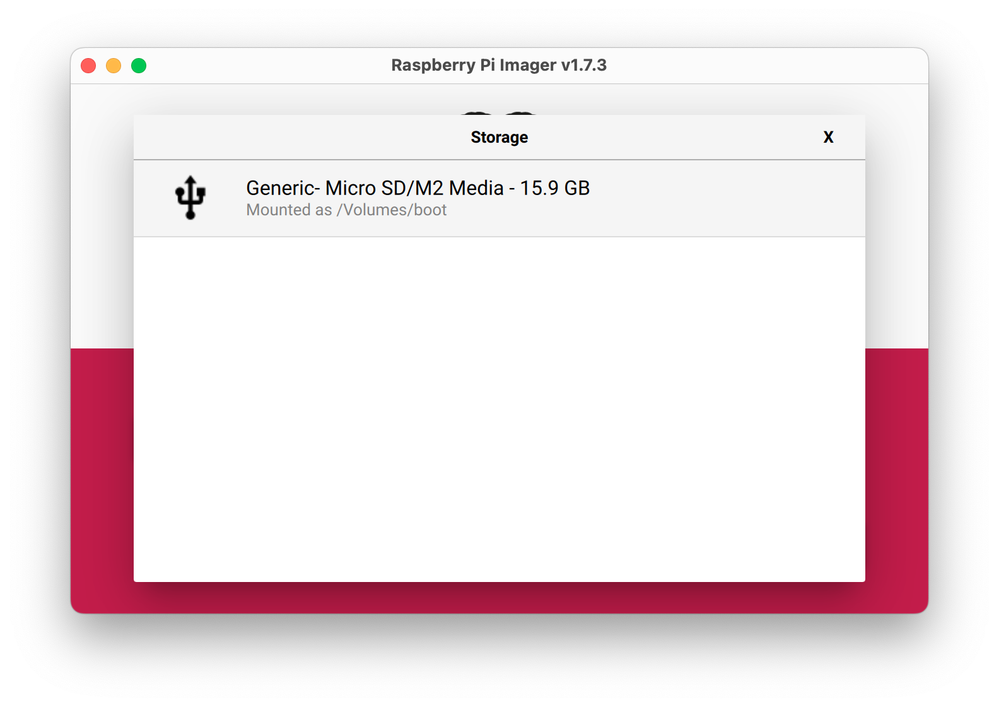

3. Specify advanced configuration by clicking on a cog icon:
   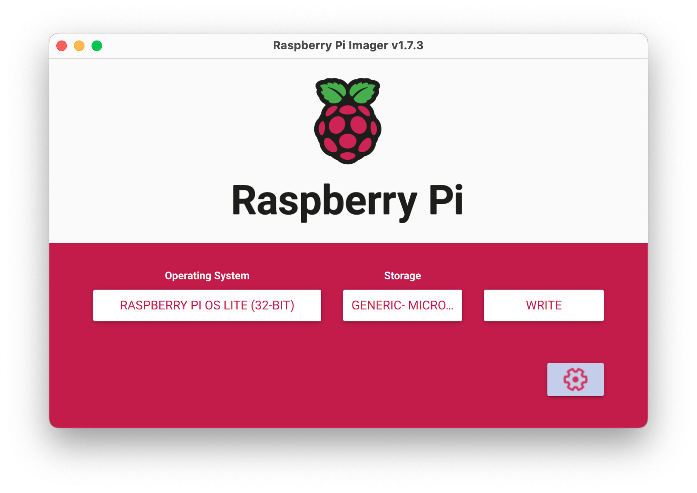
    1. Specify your own hostname and enable SSH to remotely access your Raspberry Pi over the network:
       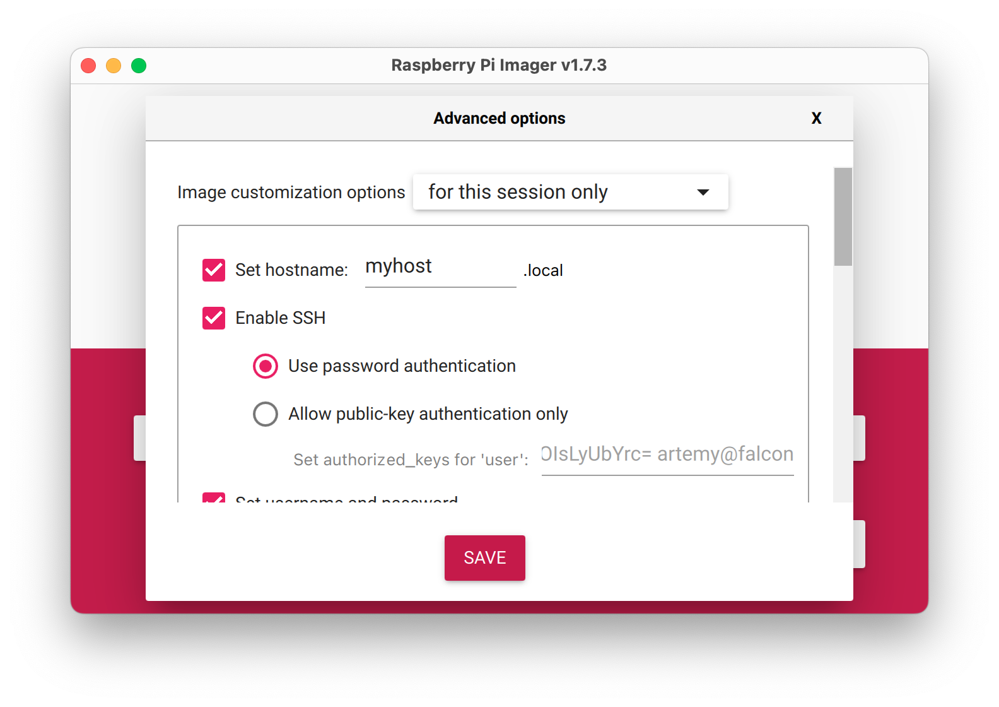
    2. Set your own custom user credentials and wifi connection settings
       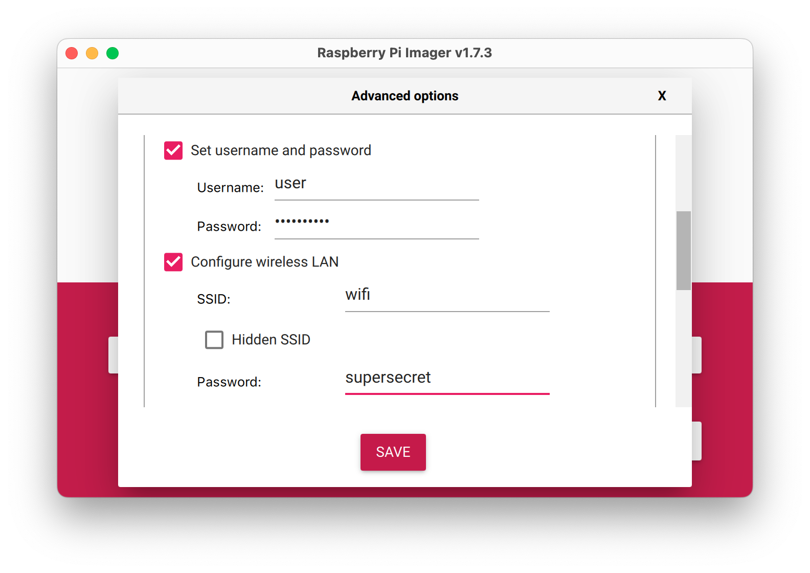
    3. Set correct locale and time zone and select "Eject media when finished"
       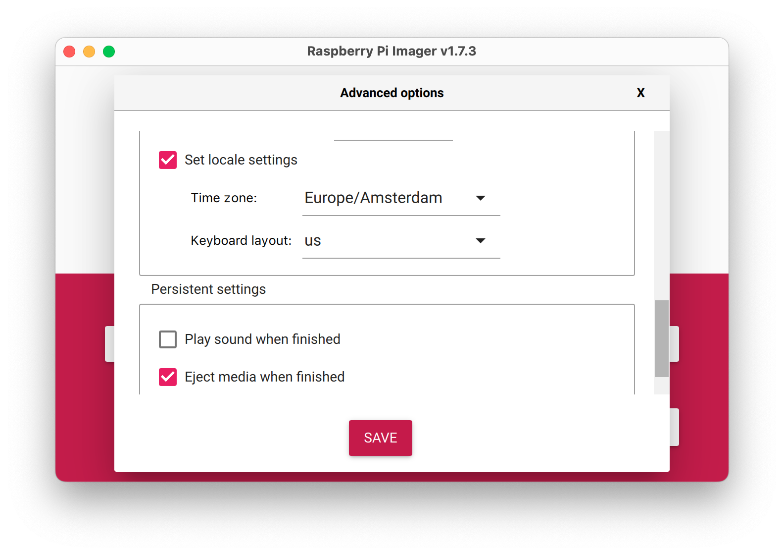
4. Press "Write" to write image to SD Card
5. When the image write is done, you can take the SD card, insert it in your Raspberry Pi computer and power it up to boot.

## Configure Raspberry Pi to work with Smart Car peripherals

If all the previous steps are performed successfully, in a few minutes your Raspberry Pi should boot up.
Once it is boots, you should be able to connect to it via SSH by using the hostname you specified earlier.

To configure Raspberry Pi to work with Smart Car peripherals, perform the following commands over SSH:

1. System update:
    ```shell
    sudo apt-get update
    sudo apt-get dist-upgrade
    ```
2. Peripheral configuration
   Run the Raspberry Pi Configuration tool with the following command:
   ```shell
   sudo raspi-config
   ```
   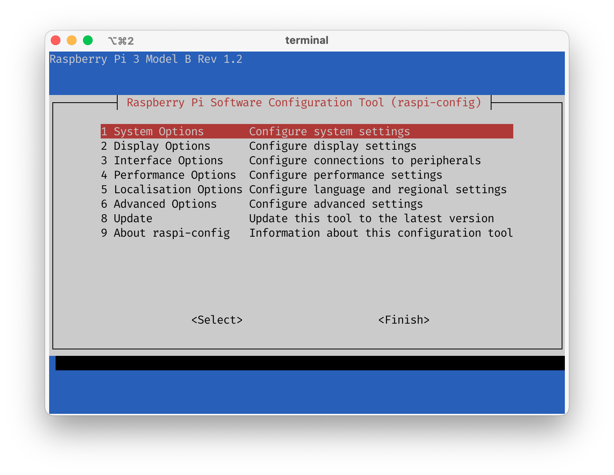
    1. Configure localisation options in "Localisation Options"->"Locale":
        1. Unselect `en_GB.UTF-8` and select `en_US.UTF-8`
           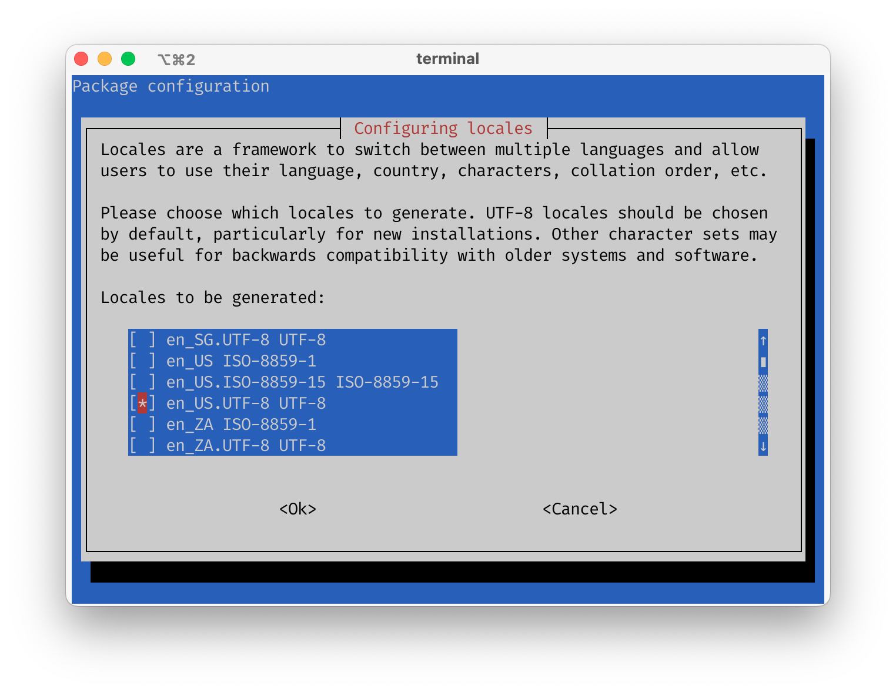
        2. On the next screen "Default locale for the system environment", select `en_US.UTF-8`:
           
    2. Enable Raspberry Pi interfaces via "Interface Options":
        1. Enable "Legacy Camera":
           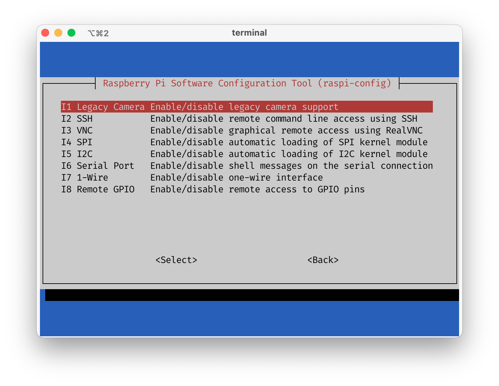
        2. Enable "I2C":
           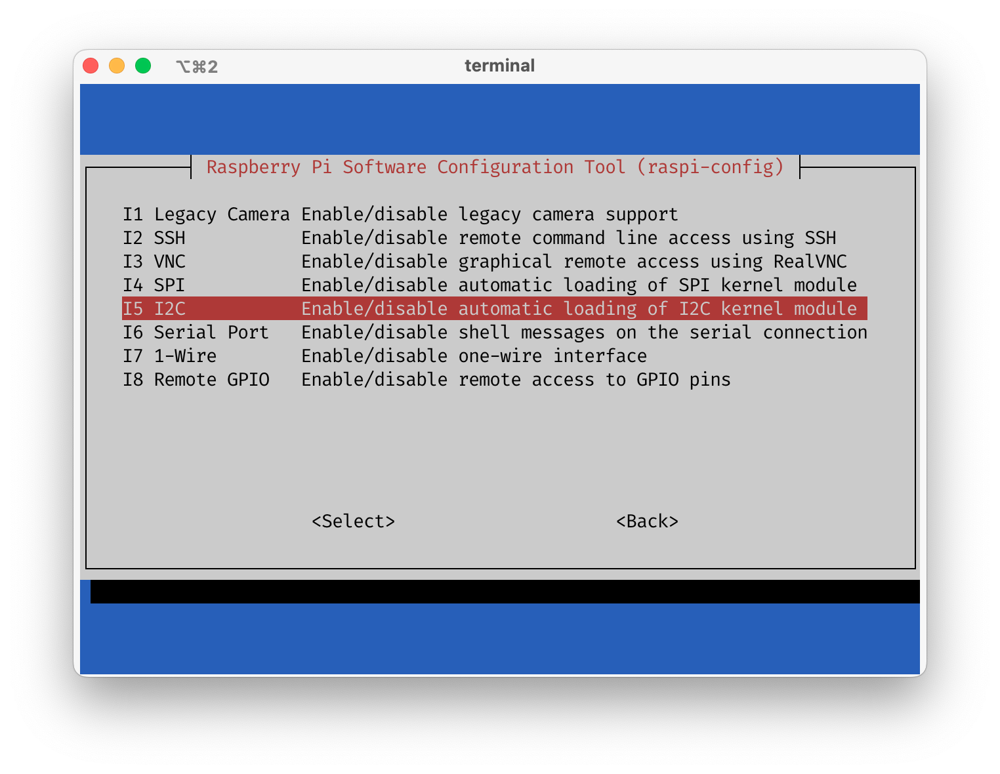

3. Make sure that audio drivers are disabled
   
   Onboard LEDs use the same pins as the audio, so in order to avoid interference, onboard audio should be disabled
    1. Update `/boot/config.txt`:

       Open the file with `nano`:
       ```shell
       sudo nano /boot/config.txt
       ```
       Make sure the line `dtparam=audio=on` is commented out like following:
       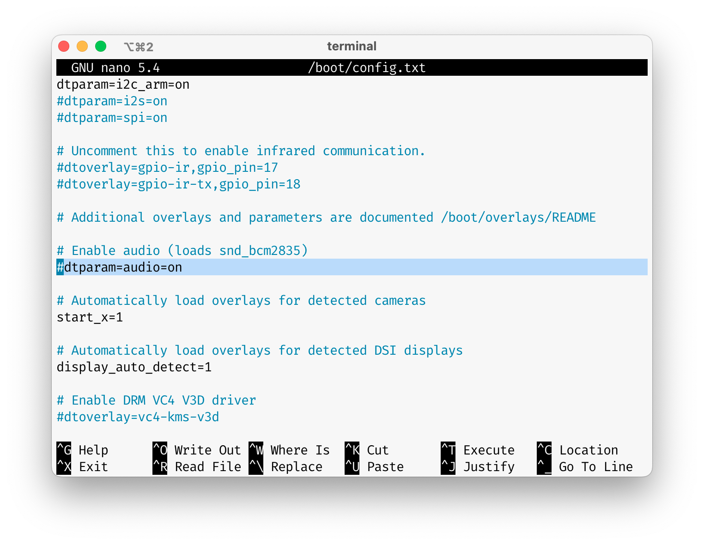
       Exit the `nano` editor with `Ctrl+X` and confirm updating the file
    2. Blacklist the audio driver with the following command:
       ```shell
       sudo sh -c "echo 'blacklist snd_bcm2835' >> /etc/modprobe.d/snd-blacklist.conf"
       ```
4. Reboot the Raspberry Pi to apply the changes:
   ```shell
   sudo reboot
   ```
