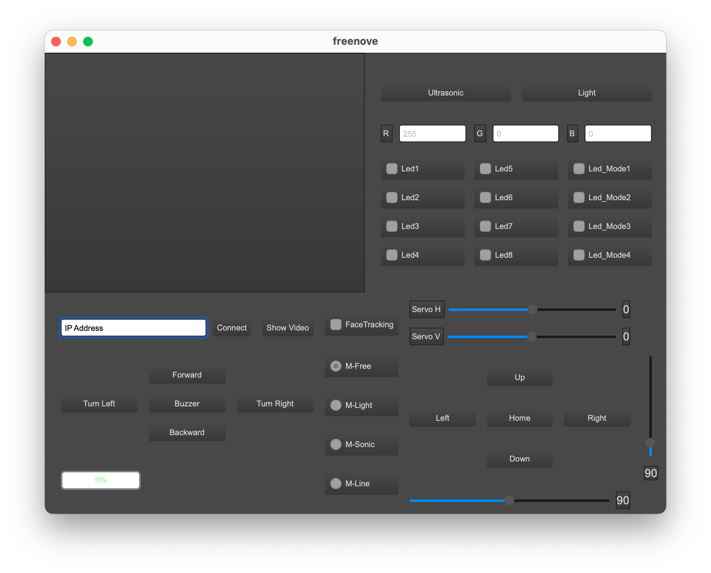

# Software Description

Included software consists of two parts:

- [Server](../code/server)

  directory contains code that runs on Raspberry Pi and controls various parts of Smart Car
    - [adc.py](../code/server/adc.py)

      ADC (Analog-to-Digital) reads data from onboard ADC Converter. Data includes readings from two light sensors in the front and current battery power level
    - [buzzer.py](../code/server/buzzer.py)

      Example of controlling the onboard piezoelectric buzzer for making high-pitched sound
    - [camera.py](../code/server/camera.py)

      Example of receiving input from onboard camera using [Picamera2](https://github.com/raspberrypi/picamera2) library
    - [command.py](../code/server/command.py)

      Enum with commands exchanged via TCP between client and server
    - [led.py](../code/server/led.py)

      Example of controlling onboard [WS2812](https://cdn-shop.adafruit.com/datasheets/WS2812B.pdf) LEDs (there's 8 in total).
    - [light_tracking.py](../code/server/light_tracking.py)

      Example of Smart Car automatically following light beam (https://youtu.be/kMzOUqFoK0E?t=24) using photoresistors at the front top of the car board.
    - [line_tracking.py](../code/server/line_tracking.py)

      Example of Smart Car automatically following tape line on the floor (https://youtu.be/kMzOUqFoK0E?t=83) using infrared sensors at the front bottom of the car board.
    - [main.py](../code/server/main.py)

      Server main executable. See Client-Server down below
    - [mode.py](../code/server/mode.py)

      Enum with Modes exchanged via TCP between client and server
    - [motor.py](../code/server/motor.py)

      Example of controlling Smart Car motors. Each motor is controlled individually via specifying [PWM](https://en.wikipedia.org/wiki/Pulse-width_modulation) duty cycle.
    - [pcf9685.py](../code/server/pca9685.py)

      Library for controlling onboard PWM chip which drives car motors and servos.
    - [server.py](../code/server/server.py)

      Server code that processes incoming commands and controls Smart Car. See Client-Server down below.
    - [servo.py](../code/server/servo.py)

      Example of controlling Smart Car servos. It is used during assembly process to straighten servos for correct orientation.
    - [test.py](../code/server/test.py)

      Tests various functionality of Smart Car
    - [thread.py](../code/server/thread.py)

      Utilities for managing threads
    - [ultrasonic.py](../code/server/ultrasonic.py)

      Example of Smart Car avoid obstacles (https://youtu.be/kMzOUqFoK0E?t=57) using ultrasonic distance sensors at the front of the car.

- [Client](../code/client)

  directory contains client code that allows remotely controlling Smart Car via server running on Raspberry Pi.
    - [client_ui.ui](../code/client/client_ui.ui)

      Client UI definition made in [Qt Designer](https://doc.qt.io/qt-6/qtdesigner-manual.html).
    - [client_ui.py](../code/client/client_ui.py)

      Client UI generated from client_ui.ui via [pyuic5](https://pypi.org/project/pyuic5-tool/)
    - [command.py](../code/client/command.py)

      Enum with commands exchanged via TCP between client and server
    - [control.py](../code/client/control.py)

      Code controlling command connectivity to the remote Smart Car: sending & receiving commands and various data
    - [haarcascade_frontalface_default.xml](../code/client/haarcascade_frontalface_default.xml)

      OpenCV classifier for face detection
    - [main.py](../code/client/main.py)

      Main class for Client. Starts and sets up the GUI.
    - [mode.py](../code/client/mode.py)

      Enum with Modes exchanged via TCP between client and server
    - [thread.py](../code/client/thread.py)

      Utilities for managing threads
    - [video.py](../code/client/video.py)

      Code controlling video streaming connectivity to the remote Smart Car.

## Client-Server

Software includes example of remote controlling Smart Car via Client and Server.

### Server

Server runs on Raspberry Pi connected to Smart Car.
Server exposes several TCP ports:

- port 8000 for transmitting video feed

  Data format: JPEG byte stream
- port 5000 for receiving commands and sending data

  Data format: text commands terminated via endline character (`\n`)

#### Prerequisites

Server code uses several dependencies listed in the [prerequisites.sh](../code/prerequisites.sh)

To install dependencies, run the following command from `code` directory:

```shell
sudo sh prerequisites.sh
```

#### Running server code

To run client, run `main.py` from the `server` directory via `sudo`:

```shell
sudo python3 main.py
```

> ⚠️ `sudo` is required by [rpi-ws281x](https://github.com/rpi-ws281x/rpi-ws281x-python) library for controlling LEDs.

When the server is running, you can connect to it with the supplied Client.

### Client

Client can be run on a remote computer and consists of a GUI controlling various features of remote Smart Car and displaying remote video feed.



As well as displaying remote video feed, it also uses OpenCV to detect face shapes on incoming video frames and highlight detected shapes with green circles (see [face_detect](../code/client/video.py) method in video.py).

#### Prerequisites

> ⚠️ It is recommended to use virtual environments with Python https://docs.python.org/3/tutorial/venv.html

Client code uses several dependencies listed in the [requirements.txt](../code/requirements.txt)

To install dependencies, run the following command from `code` directory:

```shell
pip install -r requirements.txt
```

#### Running client code

To run client, run `main.py` from the `client` directory:

```shell
python3 main.py
```

#### Using client

Client can be connected to the running server via specifying server ip in the 'IP Address' text field and pressing `Connect` button.
If successfully connected, client controls will become enabled for interaction.
To display incoming video feed, press `show video` button.
